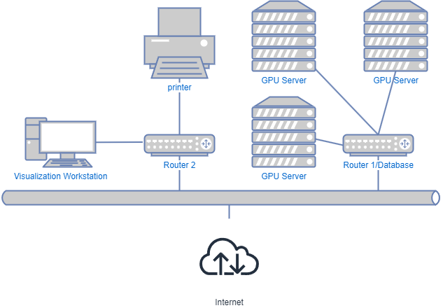
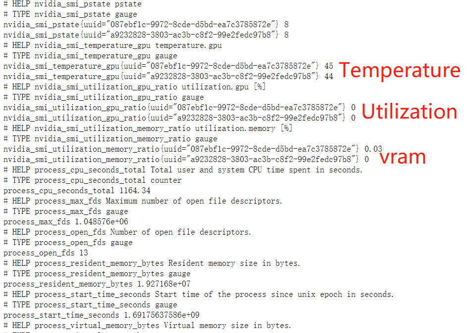

[English](https://github.com/Ricardo-H/GPU-cluster-visualization) |
[Chinese](https://github.com/Ricardo-H/GPU-cluster-visualization/blob/main/README_CN.md) |
[Japanese](https://github.com/Ricardo-H/GPU-cluster-visualization/blob/main/README_JP.md)

# GPU Cluster Visualization
        


## Project Overview

This project aims to provide real-time visualization and monitoring of the GPU cluster in the laboratory, ensuring the stable operation and performance monitoring of valuable experimental equipment.

## Project Status

Currently, the project has completed its first usable version, and we are actively developing new features and improving existing ones.

## Project Background

Time: Spring Semester 2023

Location: College of Information Science and Engineering, Ritsumeikan University - Visual Information Processing Laboratory (VIP)

This project was developed to meet the needs of the VIP laboratory, which possesses 30 different models of GPUs and requires real-time monitoring of their performance and operational status to ensure the efficient utilization and protection of experimental equipment.

### Topology:


The research lab is equipped with multiple campus network WANs, where each WAN through static address based on the routers. 

The GPU server cluster is deployed within a router running the **OpenWRT** operating system (Router 1). This setup facilitates better control over **port mapping** and allows for the flexible deployment of **Docker-based applications** within the router. Each GPU server operates on the Ubuntu Server and connects to OpenWRT using a fixed IP address.

The visualization devices are Intel NUCs based on Windows, which are compact and convenient, making them suitable for long-duration displays of web applications. These visualization devices can access the Docker applications deployed within Database by connecting to the IP address of Router 1.


### Members:
- Yinan Yang: Responsible for GPU data collection and integration.
- Youling Huang: Responsible for data visualization and monitoring alerts.

## Project Components

1. **Individual GPU Information Collection**
   Implemented using nvidia-smi(.exe) binary to collect performance and status information for individual GPUs.

2. **Integration of GPU Cluster Information and Database Setup**
   Utilizing Prometheus to establish a database for integrating and storing data from the GPU cluster.

3. **Data Visualization**
   Creating dashboards using Grafana to allow users to visualize the performance and status of the GPU cluster.

4. **Monitoring and Alerts**
   Setting up monitoring alerts using Grafana to notify users in real-time of any anomalies.


## 1. GPU Server Information Collect
In the repository, a simple deployment script has been set up to facilitate the information collection deployment for individual GPU server machines. The deployment can be achieved using the following code:
```bash
   git clone https://github.com/Ricardo-H/GPU-cluster-visualization.git
   cd GPU-cluster-visualization
   sudo bash gpu_server.sh
```
**Compatibility**:
Ubuntu 18.04+

**Theoretical compatibility**:
Debian 9+

Note that this script requires root privileges to install Docker. Therefore, you should use "sudo" for deploying Docker containers subsequently.

In detail, let's explain the technical aspects found within the script. It uses Nvidia GPU exporter for prometheus, using nvidia-smi binary to gather metrics. Project address as follows: [nvidia_gpu_exporter](https://github.com/utkuozdemir/nvidia_gpu_exporter). We use the docker version of this application, as follows: [utkuozdemir/nvidia_gpu_exporter](https://hub.docker.com/r/utkuozdemir/nvidia_gpu_exporter)

In the script, we automatically add all the GPUs of the local machine into the application container. This container invokes real-time information from nvidia-smi, packaging the information into a stream and publishing it on the local machine's port **9835**. Devices within the local area network can view the GPU status on this machine through this port, as follows:

```bash
http://<Local Machine IP Address>:9835/metrics
```
Here is a display of a portion of the output information stream, which includes the temperature, usage rate, and GPU memory utilization of the GPU with the current UUID.


## 2. Prometheus Setup